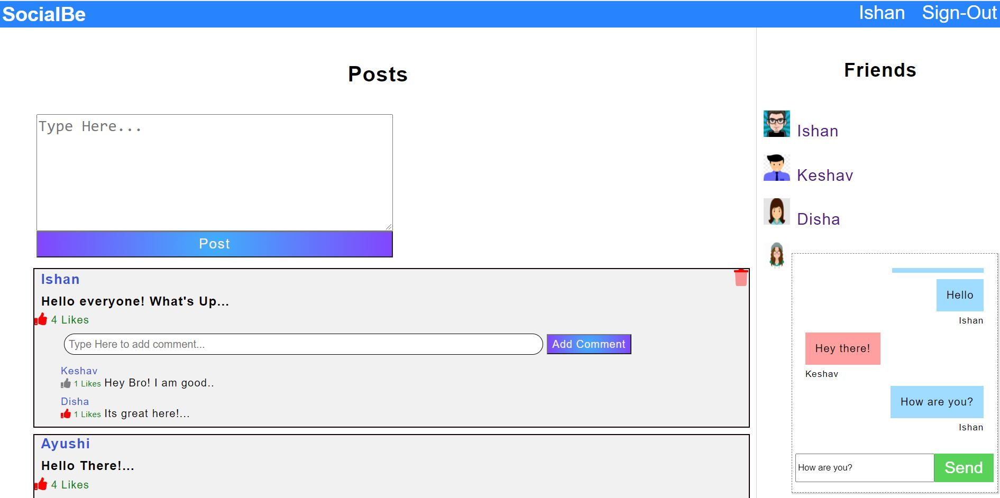
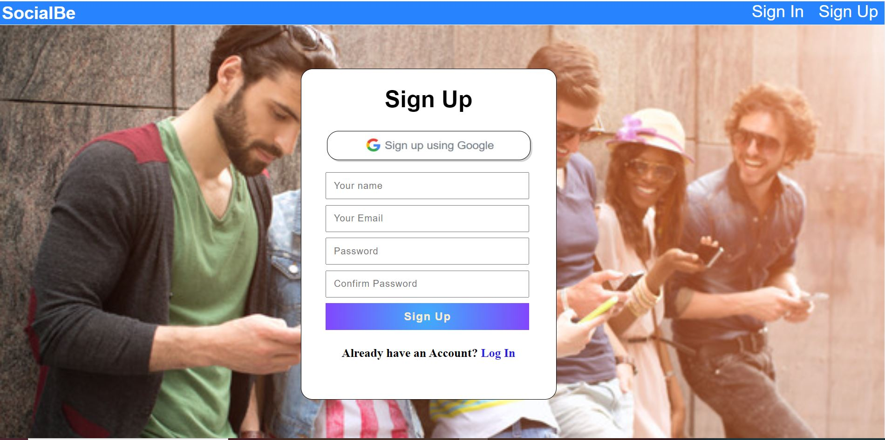
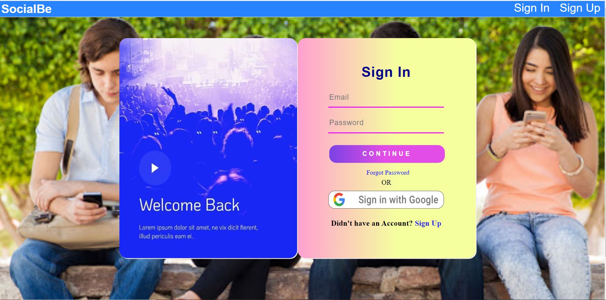
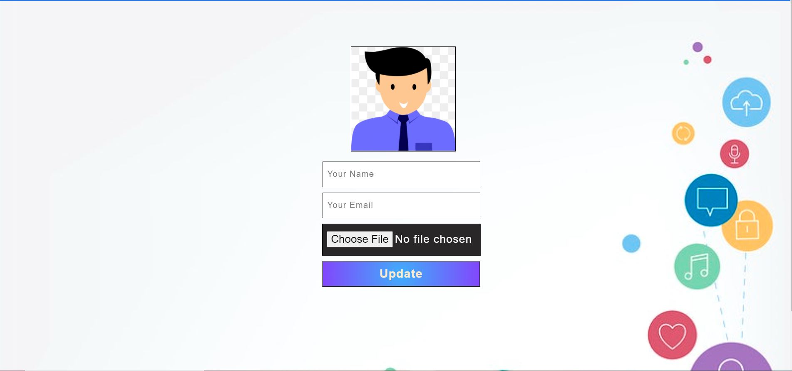
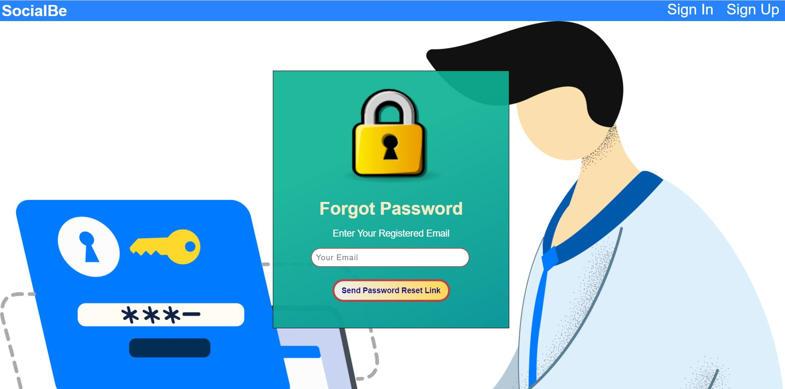

# SocialBe | A Social Media Platform
A social media site where users can create their accounts and make posts, comments, likes, etc. A social media site where users can create their accounts and make posts, comments, likes, etc. Users can also chat with each other. Full Authorization and Authentication for all users.

## Screenshots

## Technologies Stack:

### Components
- Node.js,MongoDB,Express.js,EJS
- Socket.io.
- Javascript,AJAX,jquery
- Sass,Css
- Nodemailer
- Notyjs
- MongoStore

### Insights
- passport-jwt strategy for authentication and authorization.
- passport-google-oauth2 strategy for social authentication through google.
- used Nodemailer to send out emails on different events.
- used morgan to make production logs
- Notyjs for display notifications
- used socket.io for building chat feature
- separate environment for development and production
- Api's for deleting posts and comments

### How to install
- Clone the project onto your local machine.
- Then cd SocialBe-App
- globally install and set mongodb
- npm install to install dependencies
- globally install nodemon
- nodemon index.js (run server in development mode)
- Visit your app at http://localhost:8000

### Settings for Mailer and Google Sign In
- go to environment file in config
- add your Gmail id and password to use it to send invite mails
- add Google Oauth 2 credentials for google sign in/up